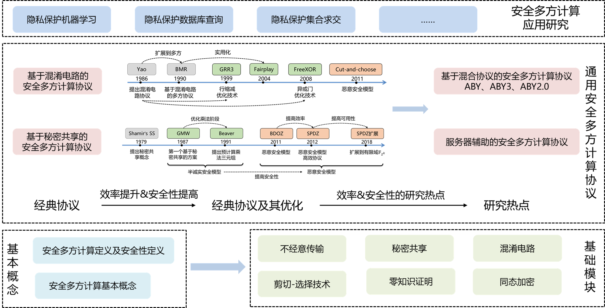

# 安全多方计算(MPC)的基本框架

在这里将介绍安全多方计算(MPC)的基本框架以及学习路线，对应地，也会提供一些学习资源。

## 1. MPC基本框架

MPC的基本概念和构建协议的基础模块是MPC的基石，在此之上有一些通用安全多方计算协议，其可以用于计算任意的功能函数，利用这些通用协议并结合应用便形成了安全多方计算的应用研究。

## 2. MPC学习路线
安全多方计算(MPC)没有一本特别权威又特别易懂的书籍供大家参考，在我们首页的[如何学习安全多方计算？](https://github.com/Stu-Yang/HITSZ-SecurityGroup-MPC#%E5%A6%82%E4%BD%95%E5%AD%A6%E4%B9%A0%E5%AE%89%E5%85%A8%E5%A4%9A%E6%96%B9%E8%AE%A1%E7%AE%97)中介绍了一些大牛的学习总结、经典课程和书籍给大家，在这里我们详细地介绍一些学习安全多方计算的基本路线，并且提供一些论文、Slides、书籍和课程等。
### **2.0 MPC学习路线的其他参考**
+ 知乎的[安全多方计算学习路线](https://zhuanlan.zhihu.com/p/351492646)
+ Yehuda Lindell教授的[Resources for Getting Started with MPC](https://u.cs.biu.ac.il/~lindell/MPC-resources.html)
+ Mike Rosulek教授的[An Annotated Bibliography of Practical Secure Computation](https://web.engr.oregonstate.edu/~rosulekm/scbib/index.php?n=Main.GettingStarted)
  
### **2.1 基本概念**

安全多方计算的基本概念主要包括MPC中诚实方、腐坏方和敌手的概念、计算模型和安全性模型的概念，还有关于MPC的形式化定义以及安全性的形式化定义

+ **MPC基本概念**：掌握基本概念，如诚实方、腐坏方和敌手、半诚实模型和恶意模型等
  + Lindell教授的最新MPC综述:[Secure Multiparty Computation (MPC)](https://eprint.iacr.org/2020/300.pdf)：介绍了MPC的基本内容，学习之后可以梳理出基本概念
  + Hazay和Lindell的著作[[Hazay&Lindell2010]Efficient Secure Two-Party Protocols](https://u.cs.biu.ac.il/~lindell/efficient-protocols.html)的第1章
+ **MPC定义及其安全性定义**：掌握MPC形式化定义，了解分析安全性的方法和形式化定义
  + Hazay和Lindell的著作[[Hazay&Lindell2010]Efficient Secure Two-Party Protocols](https://u.cs.biu.ac.il/~lindell/efficient-protocols.html)的第2章：介绍了MPC的定义、安全两方计算(2PC)的半诚实模型和恶意模型下的形式化安全性定义
+ **补充说明**：通过上面的学习便对MPC有了一个大致的理解，进一步地，有一些关于基本概念的较高层面的介绍，虽然这部分是关于基本概念，但其涉及内容深度较深，可以在学习一段时间作为总结和回顾比如Lindell的[Tutorial on Secure Multi-Party Computation](https://u.cs.biu.ac.il/~lindell/research-statements/tutorial-secure-computation.ppt)讲解，如果想看相关的视频可以参考[Introduction to Multiparty Computation (by Yehuda Lindell)](https://www.youtube.com/watch?v=aDL_KScy6hA)
### **2.2 基础模块**

MPC的基础模块是构件MPC大厦的基础零件，主要包括不经意传输、秘密共享、混淆电路、剪切-选择技术、零知识证明和同态加密。

+ **不经意传输(Oblivious Transfer, OT)**：掌握基础OT协议(1-out-of-2 OT，C-OT和R-OT等)及其优化(如IKNP03等)
  + 在知乎上有关于不经意传输的介绍[不经意传输(OT)-总结](https://zhuanlan.zhihu.com/p/399361005)
  + 关于OT协议优化，Mike Rosulek教授讲授的[Optimizations to oblivious transfer (Beaver precomputation, OT extension, IKNP protocol and variants)](https://web.engr.oregonstate.edu/~rosulekm/cryptabit/3-ot.pdf)
  + IKNP03的论文[[IKNP03]Extending Oblivious Transfers Efficiently](https://link.springer.com/content/pdf/10.1007%2F978-3-540-45146-4_9.pdf)：了解IKNP03的基本思想和技术即可
+ **秘密共享(Secret Sharing, SS)**：掌握门限秘密共享和加性秘密共享
  + 关于门限秘密共享(Threshold Secret Sharing)，需要掌握Shamir的秘密共享方案[How to share a secret](https://dl.acm.org/doi/pdf/10.1145/359168.359176)及其拉格朗日插值法
  + 关于加性秘密共享(Additive Secret Sharing)，掌握其基本原理即可，可参考一些博客[加法秘密共享(Additive Secret Sharing)](https://blog.csdn.net/qq_33154865/article/details/106271611)
+ **混淆电路(Garbled Circuits, GC)**：掌握混淆电路的基本思想及其优化
  + 这部分结合混淆电路协议进行介绍，详见下面的【混淆电路协议[Yao86]】
+ **剪切-选择技术(Cut-and-Choose)**
  + 这部分结合混淆电路协议的优化进行介绍，详见下面的【基于混淆电路的MPC协议】
+ **零知识证明(Zero Knowledge Proof)**：了解零知识证明的相关概念即可，需要注意的是安全多方计算和零知识证明关系密切，在最初的安全多方计算理论研究中，通常利用零知识证明技术来将安全多方计算的半诚实模型扩展到恶意模型
  + 关于零知识证明，在知乎上有一些通俗易懂的讲解：[探索零知识证明系列](https://www.zhihu.com/people/guo-yu-89-75/posts)，Vitaly Shmatikov教授的幻灯片[Introduction to zero-knowledge proofs](https://www.cs.utexas.edu/~shmat/courses/cs380s_fall09/16zk.ppt)也简单介绍了零知识证明
  + 如果想进一步了解可以参考Lindell写的密码学基础教程[Foundations of Cryptography 89-856](https://u.cs.biu.ac.il/~lindell/89-856/main-89-856.pdf)第5章到第8章
  + 关于系统学习零知识证明，请参考[zero-knowledge-proof](https://github.com/Stu-Yang/HITSZ-SecurityGroup-MPC/tree/main/zero-knowledge-proof)
+ **同态加密(Homomorphic Encryption)**：了解同态加密的相关概念即可
  + 如果是只研究安全多方计算，对于同态加密不作深入研究的话，只需要在论文阅读、课题研究中遇到了同态加密后再进行学习。关于同态加密的学习路线，可参见[全同态加密学习路线](https://zhuanlan.zhihu.com/p/346531595)以及相关博客
  
### **2.3 经典协议**
在学习完基础模块后可以开始学习经典协议，这些协议是整个安全多方计算理论研究的基础，在这里学习经典协议本身即可，关于经典协议的效率&安全性优化见【通用安全多方计算协议】
+ **混淆电路协议[Yao86]**：混淆电路协议是姚期智先生与1986年提出的半诚实模型下支持布尔电路的安全两方计算，其通信轮数为常数轮，其核心是混淆电路和不经意传输。混淆电路协议十分重要，需要掌握混淆电路协议的思想和协议流程
  + Vitaly Shmatikov教授的幻灯片[Yao’s Protocol](https://www.cs.utexas.edu/~shmat/courses/cs380s_fall09/17yao.ppt)简单地介绍了混淆电路协议的流程
  + Mike Rosulek教授的[Overview of secure computation (applications and definitions) and textbook Yao's protocol](https://web.engr.oregonstate.edu/~rosulekm/cryptabit/1-overview.pdf)的第二部分介绍了经典的混淆电路协
  + Sophia Yakoubov博士的学习笔记[A Gentle Introduction to Yao’s Garbled Circuits](https://web.mit.edu/sonka89/www/papers/2017ygc.pdf)中的第1部分也介绍了混淆电路协议
+ **GMW协议[GMW87]**：GMW协议是Goldreich等人在1987年基于加性秘密共享和不经意传输提出的半诚实模型下支持布尔电路和算术电路的安全多方计算协议，需要掌握GMW协议的流程和具体细节。
  + 知乎上关于GMW协议的简单介绍[GMW Protocol 介绍](https://zhuanlan.zhihu.com/p/237061306)和[GMW Protocol - n parties 介绍](https://zhuanlan.zhihu.com/p/303837388)
  + David Evans教授的著作[[Evans et al.2018]A Pragmatic Introduction to Secure Multi-Party Computation](https://securecomputation.org/)第3章的第2节介绍了GMW协议的动机和流程
  + Benny Pinkas教授在第5届BIU密码学冬令营上讲授了关于The GMW Multi-Party Protocol and Oblivious Transfer Extension ([slides](http://cyber.biu.ac.il/wp-content/uploads/2017/01/3-1.pdf) and [video](https://www.youtube.com/watch?v=4YwvZaA9IEg&index=3&list=PLXF_IJaFk-9BFn8M-dsEm5x3-5Cvji3V9))的基本知识

+ **BGW协议[BGW88]**：BGW协议是Goldwasser等人在1988年基于Shamir秘密共享提出的半诚实模型下支持布尔电路和算术电路的安全多方计算协议，事实上协议还支持恶意模型，需要掌握BGW协议的基本思想和具体过程
  + David Evans教授的著作[[Evans et al.2018]A Pragmatic Introduction to Secure Multi-Party Computation](https://securecomputation.org/)第3章的第3节介绍了BGW协议的动机和流程
  + Arpita Patra教授关于BGW的课程[BGW protocol](https://www.csa.iisc.ac.in/~arpita/FoSC17/Lecture7.pptx)
+ **BMR协议[BMR90]**：BMR协议是Beaver等人在1990年基于混淆电路协议提出的支持布尔电路的安全多方计算协议，保持了混淆电路协议交互轮数为常数轮的特性，需要了解BMR协议的主要思想
  + David Evans教授的著作[[Evans et al.2018]A Pragmatic Introduction to Secure Multi-Party Computation](https://securecomputation.org/)第3章的第4节至第5节介绍了BMR的基本思想
  + Benny Pinkas在第5届BIU密码学冬令营上讲授了关于Yao’s Two-Party Protocol and the BMR Multi-Party Protocol ([slides](http://cyber.biu.ac.il/wp-content/uploads/2017/01/2-1.pdf) and [video](https://www.youtube.com/watch?v=GjhvJxelIVQ&index=2&list=PLXF_IJaFk-9BFn8M-dsEm5x3-5Cvji3V9))的基本知识，里面介绍了混淆电路协议的流程和证明、BMR协议的流程

### **2.4 通用安全多方计算协议**
+ **基于混淆电路的MPC协议**：了解混淆电路协议的优化，了解混淆电路协议的安全性证明
  + Mike Rosulek教授讲授的混淆电路的基本思想及其优化[Optimizations to garbled circuits (point-permute, free-XOR, half-gates, arithmetic garbling)](https://web.engr.oregonstate.edu/~rosulekm/cryptabit/2-gc.pdf)
  + Sophia Yakoubov博士的学习笔记[A Gentle Introduction to Yao’s Garbled Circuits](https://web.mit.edu/sonka89/www/papers/2017ygc.pdf)中的第2部分系统地介绍了混淆电路协议的优化
  + Lindell和Pinkas在论文[A Proof of Security of Yao’s Protocol for Two-Party Computation](https://eprint.iacr.org/2004/175.pdf)证明了混淆电路协议的安全性
+ **基于秘密共享的MPC协议**
  + SPDZ框架：基于秘密共享和有限同态加密的协议框架
+ **基于同态加密的MPC协议**
+ **混合协议**
  + ABY系列：基于布尔电路、算术电路和混淆电路的协议框架，包括ABY、ABY3和ABY2.0
### **2.5 应用研究**
+ 隐私集合操作(Private Set Operation)
+ 隐私保护机器学习(Privacy Preserving Machine Learning)
+ ...
