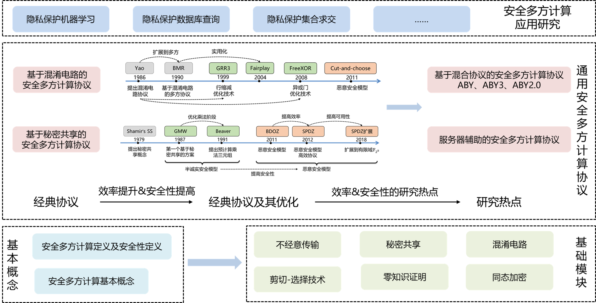

# 安全多方计算学习框架
在这里将介绍安全多方计算(MPC)的基本框架以及学习路线，对应地，也会提供一些学习资源。

## 1. 安全多方计算基本框架

MPC的基本概念和构建协议的基础模块是MPC的基石，在此之上有一些通用安全多方计算协议，其可以用于计算任意的功能函数，利用这些通用协议并结合应用便形成了安全多方计算的应用研究。

> **关于【混淆电路】和【秘密共享】的优劣**
> 
> 安全多方计算协议可以分别通过秘密分享（GMW系列）和混淆电路（GC系列）构造，两种方案在通信轮数和通信量方面各有优劣。以布尔电路为例：GMW系列方案通信量少，但是每一层与门计算需要一轮交互，因此通信轮数和电路深度成正比；GC系列方案通信轮数是常数轮，但是要传输混乱表，因此通信量较大。因而，GMW系列方案适合应用在低延迟网络中以获得较大的吞吐量，而GC系列方案则适合应用在延迟较大的网络中，减少因为网络延迟带来的时间开销。根据[GMW v.s. Yao](https://link.springer.com/chapter/10.1007/978-3-642-39884-1_23)中的介绍，对于深度较浅、尺寸较大的电路来说，GMW系列的方案更能达到更好的整体性能。
> 
> 不过，近些年也提出Look-Up Table (LUT)技术，LUT是介于GMW和GC之间的一种技术，既可以有效的降低GMW方案的通信轮数，同时通信量也比GC系列的方案更优。LUT在计算复杂函数时具有广泛的应用。
> 
> 参考文章：[安全多方计算为什么要用ot协议?](https://www.zhihu.com/question/323154953/answer/2991550865)

## 2. 安全多方计算学习路线
安全多方计算(MPC)没有一本特别权威又特别易懂的书籍供大家参考，在上级页面的[如何学习安全多方计算？](https://github.com/Stu-Yang/HITSZ-SecurityGroup-MPC/tree/main/mpc#%E5%A6%82%E4%BD%95%E5%AD%A6%E4%B9%A0%E5%AE%89%E5%85%A8%E5%A4%9A%E6%96%B9%E8%AE%A1%E7%AE%97)中，我们介绍了一些大牛的学习总结、经典课程和书籍给大家，在这里我们详细地介绍一些学习安全多方计算的基本路线，并且提供一些论文、Slides、书籍和课程等。
> **安全多方计算学习路线的其他参考**
> + 知乎的[安全多方计算学习路线](https://zhuanlan.zhihu.com/p/351492646)
> + Yehuda Lindell教授的[Resources for Getting Started with MPC](https://u.cs.biu.ac.il/~lindell/MPC-resources.html)
> + Mike Rosulek教授的[An Annotated Bibliography of Practical Secure Computation](https://web.engr.oregonstate.edu/~rosulekm/scbib/index.php?n=Main.GettingStarted)

### **2.0 隐私计算概览**

在学习安全多方计算之前，可以从宏观的角度来看一下安全多方计算所处在的隐私计算背景，下面是蚂蚁集团推出的隐私计算相关介绍，里面有一些和安全多方计算相关的知识：
+ 隐私计算MOOC（相关MOOC视频见[隐私计算MOOC系列课程](https://www.bilibili.com/video/BV1jY411d78Y/?)）
  + 【熟悉】[第1讲《隐私计算全局概览》](https://www.yuque.com/secret-flow/admin/fak5z95s31u9ow8g)
  + 【掌握】[第2讲《多方安全计算技术基础》](https://www.yuque.com/secret-flow/admin/th11ggw672doi4sd)
  + 【了解】[第4讲《安全求交集和匿踪查询》](https://www.yuque.com/secret-flow/admin/ky5u6npml6lrxwg8)
  + 【熟悉】[第8讲《多方安全计算机器学习》](https://www.yuque.com/secret-flow/admin/owpkkbf5q2eu5euk)
  + 【了解】[第10讲 《高性能多方安全数据分析MPC SQL》](https://www.yuque.com/secret-flow/admin/umyl73d5h6hbosas)

### **2.1 基本概念**

安全多方计算的基本概念主要包括MPC中诚实方、腐坏方和敌手的概念、计算模型和安全性模型的概念，还有关于MPC的形式化定义以及安全性的形式化定义

+ **MPC基本概念**：掌握基本概念，如诚实方、腐坏方和敌手、半诚实模型和恶意模型等
  + 冯登国院士关于安全多方计算的报告: [video](https://www.bilibili.com/video/BV16j411q7pf)
    + Lecture 1: 安全多方计算（MPC）的基本概念及基础组件
    + Lecture 2: 基于秘密分享方法的MPC协议
    + Lecture 3: 基于混淆电路方法的MPC协议
  + Lindell教授的最新MPC综述:[Secure Multiparty Computation (MPC)](https://eprint.iacr.org/2020/300.pdf)：介绍了MPC的基本内容，学习之后可以梳理出基本概念
  + Hazay和Lindell的著作[[Hazay&Lindell2010]Efficient Secure Two-Party Protocols](https://u.cs.biu.ac.il/~lindell/efficient-protocols.html)的第1章
+ **MPC定义及其安全性定义**：掌握MPC形式化定义，了解分析安全性的方法和形式化定义
  + Hazay和Lindell的著作[[Hazay&Lindell2010]Efficient Secure Two-Party Protocols](https://u.cs.biu.ac.il/~lindell/efficient-protocols.html)的第2章：介绍了MPC的定义、安全两方计算(2PC)的半诚实模型和恶意模型下的形式化安全性定义
  + [完美(Perfect)、统计(Statistical)和计算(Computational)安全](https://zhuanlan.zhihu.com/p/463077897)：密码学中，定义安全性通过基于理想/现实模拟实验（ideal/real simulation）来定义，根据《An Introduction to secret sharing-based MPC》一书中章节 1.1.2，总结完美安全、统计安全和计算安全的从入门到放弃的理解。
+ **补充说明**：通过上面的学习便对MPC有了一个大致的理解，进一步地，有一些关于基本概念的较高层面的介绍，虽然这部分是关于基本概念，但其涉及内容深度较深，可以在学习一段时间作为总结和回顾比如Lindell的[Tutorial on Secure Multi-Party Computation](https://u.cs.biu.ac.il/~lindell/research-statements/tutorial-secure-computation.ppt)讲解，如果想看相关的视频可以参考[Introduction to Multiparty Computation (by Yehuda Lindell)](https://www.youtube.com/watch?v=aDL_KScy6hA)
### **2.2 基础模块**

MPC的基础模块是构件MPC大厦的基础零件，主要包括不经意传输、秘密共享、混淆电路、剪切-选择技术、零知识证明和同态加密。

+ **不经意传输(Oblivious Transfer, OT)**：掌握基础OT协议(1-out-of-2 OT，C-OT和R-OT等)及其优化(如IKNP03等)
  + 在知乎上有关于不经意传输的介绍[不经意传输(OT)-总结](https://zhuanlan.zhihu.com/p/399361005)
  + 关于OT协议优化，Mike Rosulek教授讲授的[Optimizations to oblivious transfer (Beaver precomputation, OT extension, IKNP protocol and variants)](https://web.engr.oregonstate.edu/~rosulekm/cryptabit/3-ot.pdf)
  + IKNP03的论文[[IKNP03]Extending Oblivious Transfers Efficiently](https://link.springer.com/content/pdf/10.1007%2F978-3-540-45146-4_9.pdf)：了解IKNP03的基本思想和技术即可
+ **秘密共享(Secret Sharing, SS)**：掌握门限秘密共享和加性秘密共享
  + 关于门限秘密共享(Threshold Secret Sharing)，需要掌握Shamir的秘密共享方案[How to share a secret](https://dl.acm.org/doi/pdf/10.1145/359168.359176)及其拉格朗日插值法
  + 关于加性秘密共享(Additive Secret Sharing)，掌握其基本原理即可，可参考一些博客[加法秘密共享(Additive Secret Sharing)](https://blog.csdn.net/qq_33154865/article/details/106271611)，更深入地可以参考论文[[DSZ15]ABY-A framework for efficient mixed-protocol secure two-party computation](https://www.ndss-symposium.org/ndss2015/ndss-2015-programme/aby-framework-efficient-mixed-protocol-secure-two-party-computation/)中【III. SHARING TYPES】的【A. Arithmetic Sharing】和【B. Boolean Sharing】即可
+ **混淆电路(Garbled Circuits, GC)**：掌握混淆电路的基本思想及其优化
  + 这部分结合混淆电路协议进行介绍，详见下面的【混淆电路协议[Yao86]】
+ **剪切-选择技术(Cut-and-Choose)**
  + 这部分结合混淆电路协议的优化进行介绍，详见下面的【基于混淆电路的MPC协议】
+ **零知识证明(Zero Knowledge Proof)**：了解零知识证明的相关概念即可，需要注意的是安全多方计算和零知识证明关系密切，在最初的安全多方计算理论研究中，通常利用零知识证明技术来将安全多方计算的半诚实模型扩展到恶意模型
  + 关于零知识证明，在知乎上有一些通俗易懂的讲解：[探索零知识证明系列](https://www.zhihu.com/people/guo-yu-89-75/posts)，Vitaly Shmatikov教授的幻灯片[Introduction to zero-knowledge proofs](https://www.cs.utexas.edu/~shmat/courses/cs380s_fall09/16zk.ppt)也简单介绍了零知识证明
  + 如果想进一步了解可以参考Lindell写的密码学基础教程[Foundations of Cryptography 89-856](https://u.cs.biu.ac.il/~lindell/89-856/main-89-856.pdf)第5章到第8章
  + 关于系统学习零知识证明，请参考[zero-knowledge-proof](https://github.com/Stu-Yang/HITSZ-SecurityGroup-MPC/tree/main/mpc/miscellaneous/zero-knowledge-proof)
+ **同态加密(Homomorphic Encryption)**：了解同态加密的相关概念即可
  + 如果是只研究安全多方计算，对于同态加密不作深入研究的话，只需要在论文阅读、课题研究中遇到了同态加密后再进行学习。关于同态加密的学习路线，可参见[全同态加密学习路线](https://zhuanlan.zhihu.com/p/346531595)以及相关博客
  
### **2.3 经典协议**
在学习完基础模块后可以开始学习经典协议，这些协议是整个安全多方计算理论研究的基础，在这里学习经典协议本身即可，关于经典协议的效率&安全性优化见【通用安全多方计算协议】
+ **混淆电路协议[Yao86]**：混淆电路协议是姚期智先生与1986年提出的半诚实模型下支持布尔电路的安全两方计算，其通信轮数为常数轮，其核心是混淆电路和不经意传输。混淆电路协议十分重要，需要掌握混淆电路协议的思想和协议流程
  + David Evans教授的著作[[Evans et al.2018]A Pragmatic Introduction to Secure Multi-Party Computation](https://securecomputation.org/)第3章的第1节介绍了混淆电路协议的基本思想，在第4章的第1节介绍了混淆电路的优化技术，在第6章的第1节至第4节介绍了Cut-and-Choose技术，这是将半诚实混淆电路协议转换为恶意混淆电路协议的经典技术
  + Vitaly Shmatikov教授的幻灯片[Yao’s Protocol](https://www.cs.utexas.edu/~shmat/courses/cs380s_fall09/17yao.ppt)简单地介绍了混淆电路协议的流程
  + Mike Rosulek教授的[Overview of secure computation (applications and definitions) and textbook Yao's protocol](https://web.engr.oregonstate.edu/~rosulekm/cryptabit/1-overview.pdf)的第二部分介绍了经典的混淆电路协
  + Sophia Yakoubov博士的学习笔记[A Gentle Introduction to Yao’s Garbled Circuits](https://web.mit.edu/sonka89/www/papers/2017ygc.pdf)中的第1部分也介绍了混淆电路协议
+ **GMW协议[GMW87]**：GMW协议是Goldreich等人在1987年基于加性秘密共享和不经意传输提出的半诚实模型下支持布尔电路和算术电路的安全多方计算协议，需要掌握GMW协议的流程和具体细节。
  + 知乎上关于GMW协议的简单介绍[GMW Protocol 介绍](https://zhuanlan.zhihu.com/p/237061306)和[GMW Protocol - n parties 介绍](https://zhuanlan.zhihu.com/p/303837388)
  + David Evans教授的著作[[Evans et al.2018]A Pragmatic Introduction to Secure Multi-Party Computation](https://securecomputation.org/)第3章的第2节介绍了GMW协议的动机和流程
  + Benny Pinkas教授在第5届BIU密码学冬令营上讲授了关于The GMW Multi-Party Protocol and Oblivious Transfer Extension ([slides](http://cyber.biu.ac.il/wp-content/uploads/2017/01/3-1.pdf) and [video](https://www.youtube.com/watch?v=4YwvZaA9IEg&index=3&list=PLXF_IJaFk-9BFn8M-dsEm5x3-5Cvji3V9))的基本知识

+ **BGW协议[BGW88]**：BGW协议是Goldwasser等人在1988年基于Shamir秘密共享提出的半诚实模型下支持布尔电路和算术电路的安全多方计算协议，事实上协议还支持恶意模型，需要掌握BGW协议的基本思想和具体过程
  + David Evans教授的著作[[Evans et al.2018]A Pragmatic Introduction to Secure Multi-Party Computation](https://securecomputation.org/)第3章的第3节介绍了BGW协议的动机和流程
  + Arpita Patra教授关于BGW的课程[BGW protocol](https://www.csa.iisc.ac.in/~arpita/FoSC17/Lecture7.pptx)
+ **BMR协议[BMR90]**：BMR协议是Beaver等人在1990年基于混淆电路协议提出的支持布尔电路的安全多方计算协议，保持了混淆电路协议交互轮数为常数轮的特性，需要了解BMR协议的主要思想
  + David Evans教授的著作[[Evans et al.2018]A Pragmatic Introduction to Secure Multi-Party Computation](https://securecomputation.org/)第3章的第4节至第5节介绍了BMR的基本思想
  + Benny Pinkas在第5届BIU密码学冬令营上讲授了关于Yao’s Two-Party Protocol and the BMR Multi-Party Protocol ([slides](http://cyber.biu.ac.il/wp-content/uploads/2017/01/2-1.pdf) and [video](https://www.youtube.com/watch?v=GjhvJxelIVQ&index=2&list=PLXF_IJaFk-9BFn8M-dsEm5x3-5Cvji3V9))的基本知识，里面介绍了混淆电路协议的流程和证明、BMR协议的流程

### **2.4 通用安全多方计算协议**
MPC协议可以大致分为两类：i) 低延迟协议和 ii) 高吞吐量协议。 低延迟协议可以使用混淆电路协议(GC)来构建，其通信轮数为常数轮。基于秘密共享(SS)的解决方案已用于高吞吐量协议，但通信轮次和乘法电路的深度成正比。 然而，与基于混淆电路的协议相比，较少的通信有助于并行执行多个基于秘密共享的协议实例，从而实现高吞吐量。特别地，基于同态加密(HE)的协议利用了同态的性质，与基于GC的协议和基于SS的协议相比，其有通信量更少但计算量更大。混合协议(Mixed-Protocol)则利用了基于GC的协议和基于SS的协议各自的优点，通过电路转换协议将秘密份额在算术秘密份额、布尔秘密份额和姚氏秘密份额之间进行转换，从而提高协议的效率。

> 延迟(Latency)和吞吐量(Throughput)
> 
> 延迟和吞吐量是通过网络处理和发送数据时使用的两个术语。延迟是从数据往返一次时所花的时间，而吞吐量是在给定时间内可以从一个地方传输到另一个地方的数据量。在安全多方计算中，基于GC的MPC协议一次通信的数据量很大，但通信轮次为常数轮，总的延迟是常数的，因此是低延迟的。而基于SS的MPC协议一次的通信量很小，但通信轮次和乘法电路的深度成正比，通过并行执行计算，使得总的吞吐量更高。

+ **基于混淆电路的MPC协议(混淆电路)**：了解混淆电路协议的优化，了解混淆电路协议的安全性证明
  + Mike Rosulek教授讲授的混淆电路的基本思想及其优化[Optimizations to garbled circuits (point-permute, free-XOR, half-gates, arithmetic garbling)](https://web.engr.oregonstate.edu/~rosulekm/cryptabit/2-gc.pdf)
  + Sophia Yakoubov博士的学习笔记[A Gentle Introduction to Yao’s Garbled Circuits](https://web.mit.edu/sonka89/www/papers/2017ygc.pdf)中的第2部分系统地介绍了混淆电路协议的优化
  + Lindell和Pinkas在论文[A Proof of Security of Yao’s Protocol for Two-Party Computation](https://eprint.iacr.org/2004/175.pdf)证明了混淆电路协议的安全性
+ **基于秘密共享的MPC协议(布尔电路、算术电路)**
  + SPDZ框架：基于秘密共享和有限同态加密的协议框架，如[Multiparty Computation from Somewhat Homomorphic Encryption](https://eprint.iacr.org/2011/535)，[Practical Covertly Secure MPC for Dishonest Majority – or: Breaking the SPDZ Limits](https://eprint.iacr.org/2012/642)，[SPDZ2k: Efficient MPC mod 2^k for Dishonest Majority](https://eprint.iacr.org/2018/482)，其中第一篇论文即为经典的SPDZ，即四位作者的姓氏首字母大写组合。
  + SPDZ框架基本的思想是将协议分为两个阶段：1）预处理阶段，为乘法运算生成乘法三元组；2）在线阶段，进行加法运算和乘法运算。同时，利用消息认证码保证协议的恶意安全性。
  + Ivan Damgård在第5届BIU密码学冬令营上讲授了关于SPDZ的相关内容（[slide-part1&part2](http://cyber.biu.ac.il/wp-content/uploads/2017/01/13.pdf)和[video-part1](https://www.youtube.com/watch?v=N80DV3Brds0&list=PLXF_IJaFk-9BFn8M-dsEm5x3-5Cvji3V9&index=12)、[video-part2](https://www.youtube.com/watch?v=Ce45hp24b2E&list=PLXF_IJaFk-9BFn8M-dsEm5x3-5Cvji3V9&index=13)）
  + 关于SPDZ，可查阅[What is SPDZ? Part 1: MPC Circuit Evaluation Overview](https://bristolcrypto.blogspot.com/2016/10/what-is-spdz-part-1-mpc-circuit.html)，[What is SPDZ? Part 2: Circuit Evaluation](https://bristolcrypto.blogspot.com/2016/10/what-is-spdz-part-2-circuit-evaluation.html)，[MASCOT: Faster Malicious Arithmetic Secure Computation with Oblivious Transfer](https://eprint.iacr.org/2016/505)，[What is SPDZ? Part 3: SPDZ specifics](https://bristolcrypto.blogspot.com/2016/11/what-is-spdz-part-3-spdz-specifics.html)
+ **基于同态加密的MPC协议**
+ **基于混合协议的安全多方计算**
  + ABY系列：基于布尔电路、算术电路和混淆电路的协议框架，包括ABY、ABY3和ABY2.0
### **2.5 应用研究**
+ 隐私集合操作(Privacy-Preserving Set Operation)：[多方安全计算热点：隐私保护集合求交技术 (PSI) 分析研究报告](https://anquan.baidu.com/upload/ue/file/20190814/1565763561975581.pdf)
+ 隐私保护数据挖掘(Privacy-Preserving Data Mining)：Lindell和Pinkas两位大牛写的[Secure Multiparty Computation for Privacy-Preserving Data Mining](https://eprint.iacr.org/2008/197.pdf)
+ 隐私保护机器学习(Privacy-Preserving Machine Learning)
+ ...
